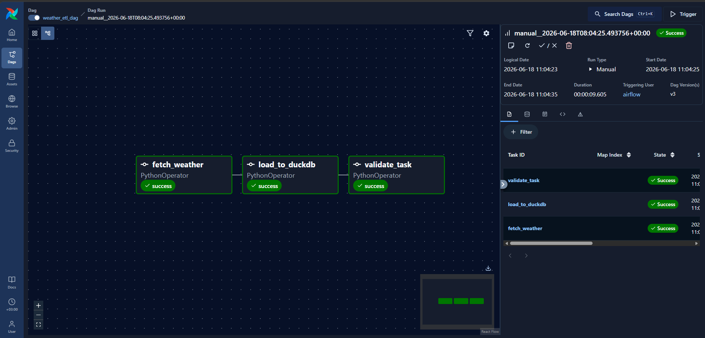
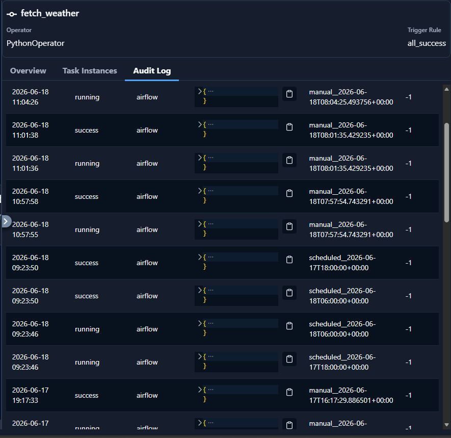
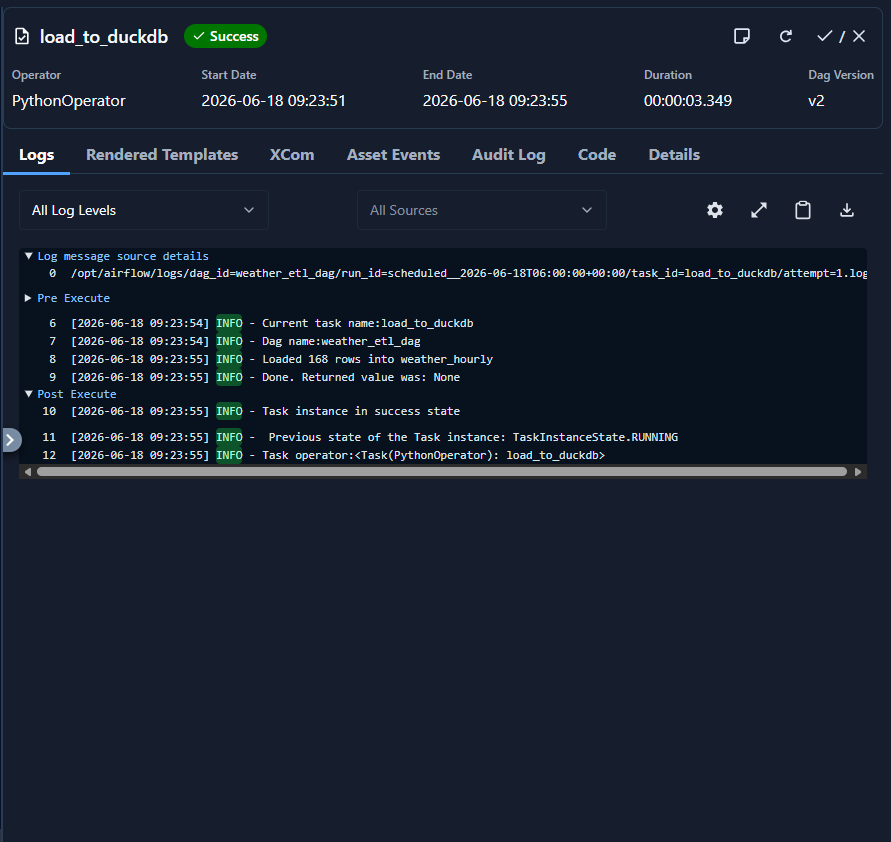
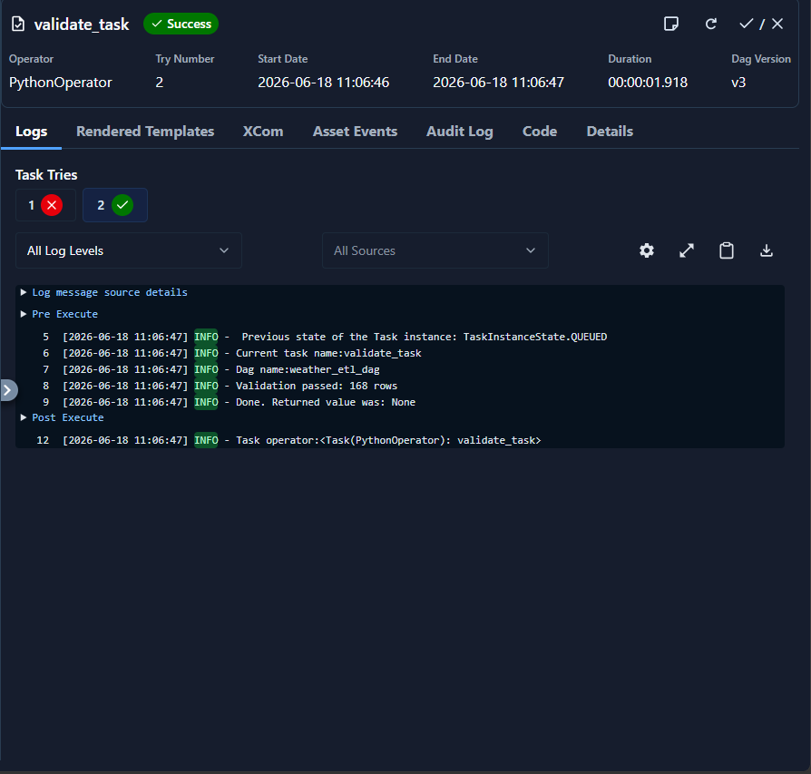

# Weather ETL Pipeline with Apache Airflow

## Overview

This project demonstrates an end-to-end ETL (Extract, Transform, Load) pipeline orchestrated using Apache Airflow.

The pipeline extracts weather forecast data from the Open-Meteo API, transforms the JSON response into a structured dataset, stores it as a staging CSV file, loads it into DuckDB, and validates the final dataset.

The project showcases workflow orchestration, task dependencies, scheduling, retries, monitoring, and data validation using modern data engineering tools.

---

## Architecture

```text
Open-Meteo API
      │
      ▼
fetch_weather
      │
      ▼
weather_staging.csv
      │
      ▼
load_to_duckdb
      │
      ▼
weather_hourly (DuckDB)
      │
      ▼
validate_data
```

---

## Technologies Used

* Apache Airflow
* Docker & Docker Compose
* Python
* Pandas
* Requests
* DuckDB

---

## Project Structure

```text
airflow-etl-project/
│
├── dags/
│   ├── hello_world_dag.py
│   └── weather_etl_dag.py
│
├── data/
│
├── images/
│   ├── dag_graph.png
│   ├── fetch_weather_successful_run.png
│   ├── load_task_logs.png
    └── validate_task_logs.png
│
├── plugins/
├── include/
│
├── Dockerfile
├── requirements.txt
├── docker-compose.yaml
├── .gitignore
└── README.md
```

---

## ETL Workflow

### Extract

Weather forecast data is fetched from the Open-Meteo API using a Python task running inside Airflow.

### Transform

The JSON response is converted into a structured Pandas DataFrame containing:

* Timestamp
* Temperature
* Precipitation

The transformed dataset is saved as:

```text
weather_staging.csv
```

### Load

The CSV staging file is loaded into DuckDB.

Target table:

```sql
weather_hourly
```

### Validation

A final validation task verifies that the target table contains records and raises an exception if the load process fails.

---

## Airflow Features

### Scheduling

The DAG is scheduled to run every 6 hours:

```python
schedule="0 */6 * * *"
```

### Retries

Failed tasks are automatically retried:

```python
retries=3
retry_delay=timedelta(minutes=5)
```

### Monitoring

Airflow provides:

* DAG Graph View
* Task Logs
* Execution History
* Retry Tracking
* Failure Visibility

---

## Running the Project

### Start Airflow

```bash
docker compose up airflow-init
docker compose up -d
```

### Open Airflow UI

```text
http://localhost:8080
```

Default credentials:

```text
Username: airflow
Password: airflow
```

---

## Screenshots

### DAG Graph



### Successful DAG Run



### Task Logs



### Task Logs



---

## Example Output

DuckDB database:

```text
weather.db
```

Example query:

```sql
SELECT *
FROM weather_hourly
LIMIT 10;
```

---

## Key Learning Outcomes

This project demonstrates:

* Workflow orchestration using Apache Airflow
* DAG creation and task dependencies
* API-based data ingestion
* Data transformation with Pandas
* Loading analytical datasets into DuckDB
* Dockerized data engineering environments
* Task retries and validation
* Production-style ETL pipeline design

---

## Future Improvements

* Historical weather ingestion
* Multiple city support
* Data quality testing with Great Expectations
* dbt transformations
* Email alerts on task failures
* GitHub Actions CI/CD
* Dashboarding with Streamlit or Apache Superset

---

## Author

Ahmed Essam

Data Engineering Learning Project focused on Apache Airflow, Docker, and DuckDB.
